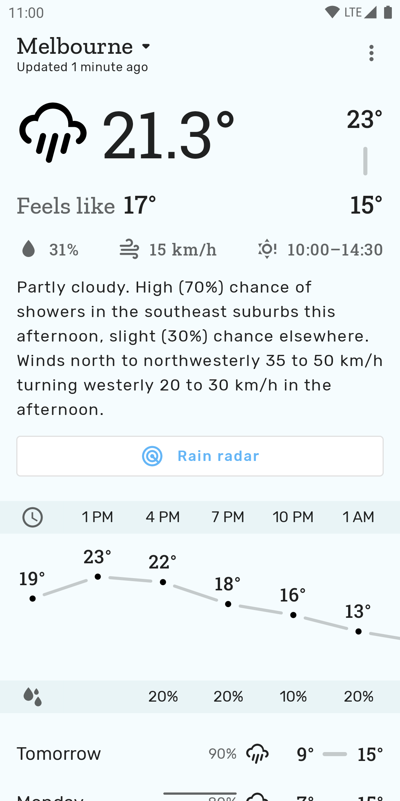

# Socket Weather

Inspired by Shifty Jelly's retired [Pocket Weather](https://ausdroid.net/2018/08/31/shifty-jelly-announces-end-pocket-weather-au-will-last-least-another-12-months-shutting/),
this app makes use of a completely undocumented API from Australia's [Bureau of Meteorology](https://weather.bom.gov.au).
It might break at a moment's notice, but while it's up we can enjoy a simple Australian weather app. It's available on
[Google Play](https://play.google.com/store/apps/details?id=codes.chrishorner.socketweather).

This app is a hobby project where I experiment with different ideas. The code, UI, and feature set are likely to change
quite a bit. That being said, if there are any features or improvements you'd like to see, feel free to submit an issue
to discuss potential PRs.

## What API are you hitting?

One that delivers data for **Australia Only**. I stumbled upon https://api.weather.bom.gov.au/v1. All requests and
responses have been modelled after poking and prodding that endpoint.

## What parts of the codebase are interesting?

- [Resizable widgets](https://github.com/chris-horner/SocketWeather/tree/master/app/src/main/kotlin/codes/chrishorner/socketweather/widget) built in Compose using [Glance](https://android-developers.googleblog.com/2021/12/announcing-jetpack-glance-alpha-for-app.html)
- A thin, [custom navigation wrapper](https://github.com/chris-horner/SocketWeather/blob/master/app/src/main/kotlin/codes/chrishorner/socketweather/Navigation.kt) around [Voyager](https://github.com/adrielcafe/voyager) for screen navigation
- [Presenters](https://github.com/chris-horner/SocketWeather/blob/34b69fc1d180b2ec1ab902b5167329c5991b873b/app/src/main/kotlin/codes/chrishorner/socketweather/util/navigation/VoyagerNavigation.kt#L67) that use [Molecule](https://github.com/cashapp/molecule) to calculate screen state with Compose. ([Video](https://www.youtube.com/watch?v=q9p4ewk-9E4) on why this is interesting)
- A custom [MoshiSerializer](https://github.com/chris-horner/SocketWeather/blob/master/app/src/main/kotlin/codes/chrishorner/socketweather/data/MoshiSerializer.kt) that integrates with Google's [DataStore](https://developer.android.com/topic/libraries/architecture/datastore)
- A [swipe-from-right drawer](https://github.com/chris-horner/SocketWeather/tree/master/app/src/debug/kotlin/codes/chrishorner/socketweather/debug) in debug builds that allows for all kinds of configuration
- [Integration](https://github.com/chris-horner/SocketWeather/blob/master/app/src/main/kotlin/codes/chrishorner/socketweather/rain_radar/map/MapView.kt) with [osmdroid](https://github.com/osmdroid/osmdroid), rather than Google Maps for the rain radar

# License

    Licensed under the Apache License, Version 2.0 (the "License");
    you may not use this file except in compliance with the License.
    You may obtain a copy of the License at

       http://www.apache.org/licenses/LICENSE-2.0

    Unless required by applicable law or agreed to in writing, software
    distributed under the License is distributed on an "AS IS" BASIS,
    WITHOUT WARRANTIES OR CONDITIONS OF ANY KIND, either express or implied.
    See the License for the specific language governing permissions and
    limitations under the License.
