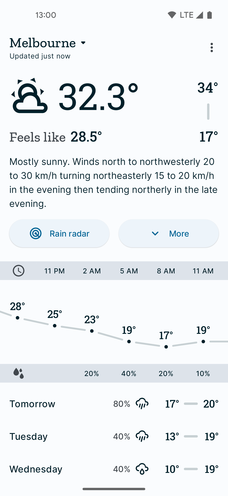

# Socket Weather

Inspired by [Shifty Jelly's](https://blog.shiftyjelly.com/) retired
[Pocket Weather](https://blog.shiftyjelly.com/2018/08/31/everything-that-begins-must-also-end/). This app makes use of
a completely undocumented API from Australia's [Bureau of Meteorology](https://weather.bom.gov.au). It might break
at a moment's notice, but while it's up we can enjoy a simple weather app. It's available on [Google Play](https://play.google.com/store/apps/details?id=codes.chrishorner.socketweather).

This app is still in the early stages of development. The code, UI, and feature set are likely to change quite a bit. If there are any features or improvements you'd like to see, feel free to submit an issue to discuss potential PRs.

## FAQs

### What the API are you hitting?

I stumbled upon https://api.weather.bom.gov.au/v1. All requests and responses have been moddeled after poking and prodding that endpoint.

### Where are the Fragments?

Not here. The codebase actually unironically used something similar to [FragNums](https://github.com/pyricau/fragnums) in the early stages of its development before swapping to [Conductor](https://github.com/bluelinelabs/Conductor). Although Conductor isn't being actively maintained anymore, it's well battle tested at this point and provides a simpler API compared to Fragments.

### What's with all the weird `Flow` stuff?

This app was used as a means to learn how to use Kotlin's [Flow](https://kotlinlang.org/docs/reference/coroutines/flow.html) and coroutines. It's quite possible that there are much better ways to achieve certain things. Feel free to submit a PR with any improvements.
